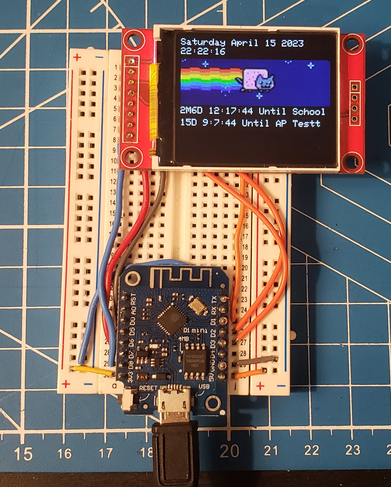
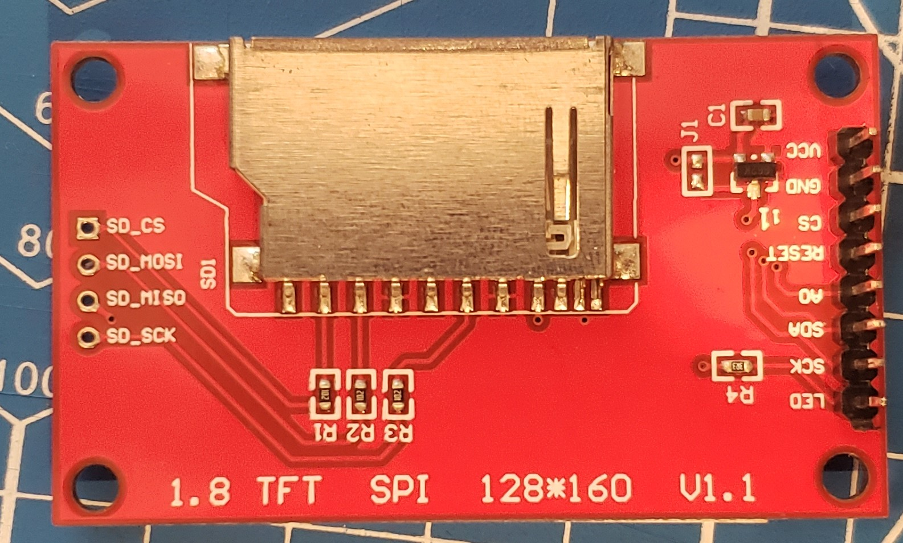
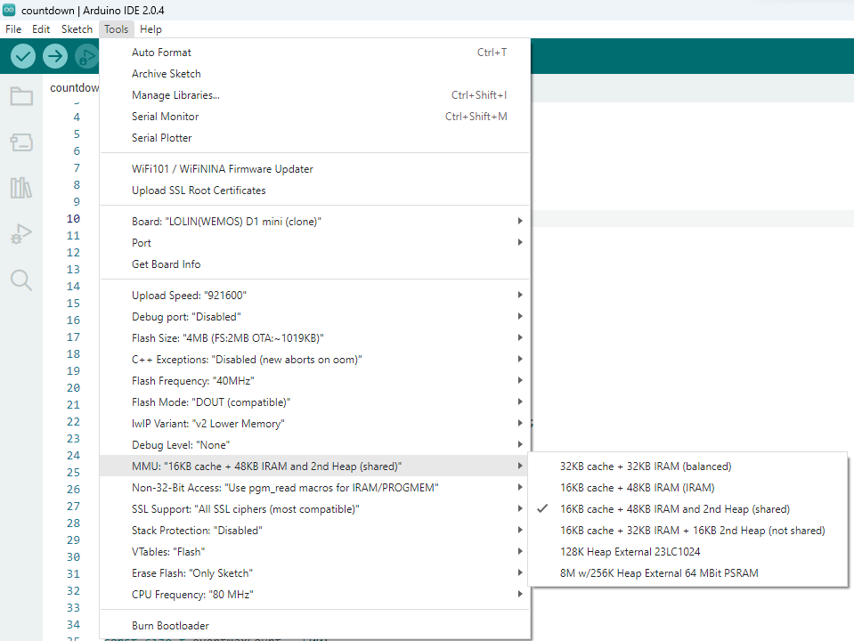

# **ESP8266ScheduleDisplay**
A esp8266 and ST7735 (1.8 inch 120x160 color tft) based schedule display with sorting, a simple web frontend, a custom animation and more

## **Example Image**

## **Wiring**
    - D1: TFT_CS
    - D2: TFT_RST
    - D3: TFT_DC (AKA TFT A0)
    - D5: TFT_SCK
    - D7: TFT_SDA
    - D8: TFT_LED
    - 5V: TFT_VCC
    - GND: TFT_GND

### **Back of the TFT:**

## **Features**
- Display schedule
- Sort schedule by date
- Display a animation for fun
- Web frontend to change the schedule
- Web frontend with MDNS so you can access it via http://scheduler.local
- Togglable backlight (via web frontend)

## **Flashing**
- Requirements
    - Arduino IDE
    - ESP8266 Board Package
        - Add via `File > Preferences > Additional Boards Manager URLs` and add `http://arduino.esp8266.com/stable/package_esp8266com_index.json`
    - ST7735 Library
        - Add via `Sketch > Include Library > Manage Libraries...` and search for `ST7735`
    - NTP Library
        - Add via `Sketch > Include Library > Manage Libraries...` and search for `NTP` Downloadable from  `(https://github.com/sstaub/NTP)`
    - ESP8266WebServer Library
        - Add via `Sketch > Include Library > Manage Libraries...` and search for `ESP8266WebServer`
- Hardware
    - ESP8266 (I used a wemos D1 mini (4MB))
    - ST7735 (1.8 inch 120x160 color tft sold at adafruit, sparkfun, all other major electronic providers)
    - Wires

- Flashing
    - Connect the esp8266 to your computer
    - Open the `ESP8266ScheduleDisplay.ino` file in the Arduino IDE
    - Select the correct board and port
    - Flash the sketch
    - **Note** You have to switch the IRAM setting in the board. See image below
    
    Make sure `16KB cache+48kB IRAM (shared)` is selected

## **Changing the Animation**
- Animations are stored in img.h as 1d array of uint16_t.
- The first 2 bytes are the width and height of the image
- The rest is the image data in RGB565 format
- There is a script in the `tools` folder that can convert images to the correct format from BMP. However, make sure your images are already the correct size. The script will not resize the image for you.
- Add your proper sized bmp files to the images directory and run `convertToPixel.py`
- Copy the output of the script into the img.h file
- Modify the switch statement at the top of `void loop()` in order to reflect the new animation's frames